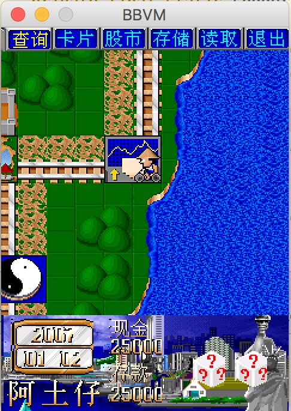

BBVM - BeBasic Virtual Machine
===========================
[](https://travis-ci.org/wenerme/bbvm)
[](https://coveralls.io/github/wenerme/bbvm?branch=master)
[](https://github.com/wenerme)
[](https://github.com/wenerme/bbvm/issues)
[](https://raw.githubusercontent.com/wenerme/bbvm/master/LICENSE)
[](https://twitter.com/intent/tweet?text=Wow:&url=https://github.com/wenerme/bbvm/)

```
; ____________________
; \______   \______   \___  _______
;  |    |  _/|    |  _/\  \/ /     \
;  |    |   \|    |   \ \   /  Y Y  \
;  |______  /|______  /  \_/|__|_|  /
;         \/        \/            \/

JMP CODE
DATA STR CHAR "Hello, BBvm",0
CODE:

OUT 1, STR
EXIT
```

```
>Hello, BBvm
```

| 中文 | English |
|:----:|:----:|
| [README](#内容)/[WIKI](https://github.com/wenerme/bbvm/wiki/主页) | [README](#Contents)/[WIKI](https://github.com/wenerme/bbvm/wiki/Home) |



# Contents
BBvm is a simple easy virtual machine that run bbin compile from bbasm which is a simple assembly too.

## Main feature
BBvm has a lot built-in system invoke with a default screen enabled device.

* Graphic draw
* Image load
* File read/write
* String op

# 内容
BBvm 是一个简单的虚拟机,其汇编码为 BBasm.

## 主要功能
BBvm 包含了大量的内建系统调用,并且运行于一个有屏幕的设备上.

* 图形操作
* 图像操作
* 文件操作
* 字符串操作

## BBasic
[BBasic](http://www.baike.com/wiki/BBASIC) 是一种掌上学习机的编程平台.BBK BBASIC,简称BB,最早由通宵虫于2006年开发,是由VMBASIC结合QuickBASIC开发而成. 运行于早期步步高学习机平台.

该项目为原步步高 BBasic 虚拟机的一个仿照实现.并在原来的基础上进行了扩展.

* 做到和 BBasic 的汇编码兼容
* 做到和 BBasic 的二进制兼容
* 实现编译 Vasm 的编译器
* 实现 BB 的虚拟机,包括图形界面等所有功能
* 对 BBAsm 进行扩展

参考
====
* [开发进度/Roadmap](https://trello.com/b/ZBl8mVYa/bbvm)
* BBAsm 语法参考[这里][bbasm-g4]
* BB 虚拟机规范参考[这里][bbvm-spec]

 [bbasm-g4]:https://github.com/wenerme/bbvm/blob/master/doc/grammar/BBAsm.g4
 [bbvm-spec]:https://github.com/wenerme/bbvm/wiki/vm-spec


